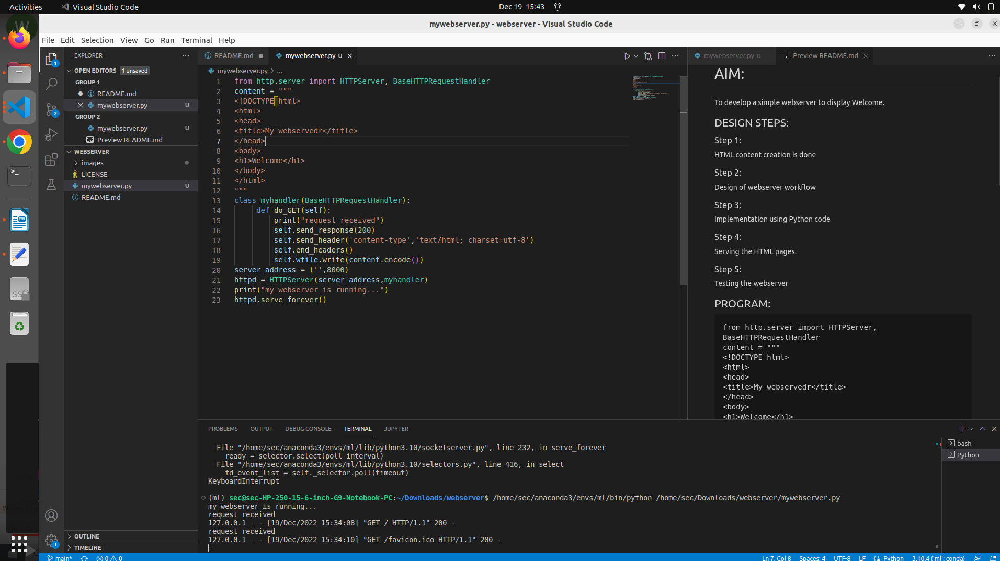
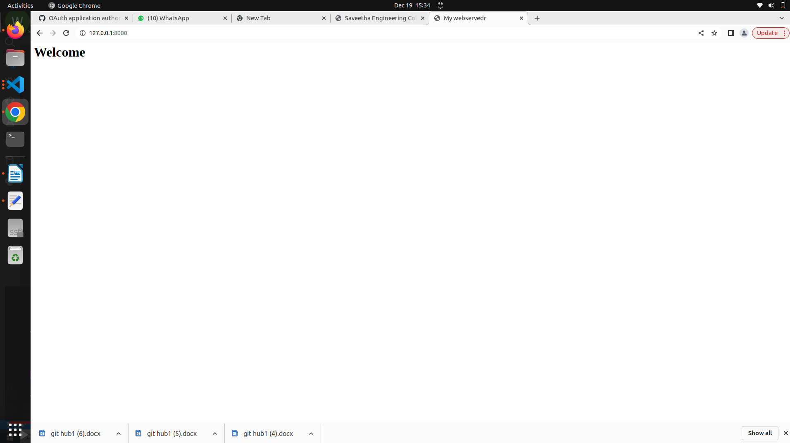

# Developing a Simple Webserver

# AIM:

To develop a simple webserver to display Welcome.

## DESIGN STEPS:

### Step 1:

HTML content creation is done

### Step 2:

Design of webserver workflow

### Step 3:

Implementation using Python code

### Step 4:

Serving the HTML pages.

### Step 5:

Testing the webserver

## PROGRAM:
```
from http.server import HTTPServer, BaseHTTPRequestHandler
content = """
<!DOCTYPE html>
<html>
<head>
<title>My webservedr</title>
</head>git 
<body>
<h1>Welcome</h1>
</body>
</html>
"""
class myhandler(BaseHTTPRequestHandler):
     def do_GET(self):
         print("request received")
         self.send_response(200)
         self.send_header('content-type','text/html; charset=utf-8')
         self.end_headers()
         self.wfile.write(content.encode())
server_address = ('',8000)
httpd = HTTPServer(server_address,myhandler)
print("my webserver is running...")
httpd.serve_forever() 
```

## OUTPUT:

### Server Side Output


### Client Side Output



## RESULT:

The program is executed succesfully
